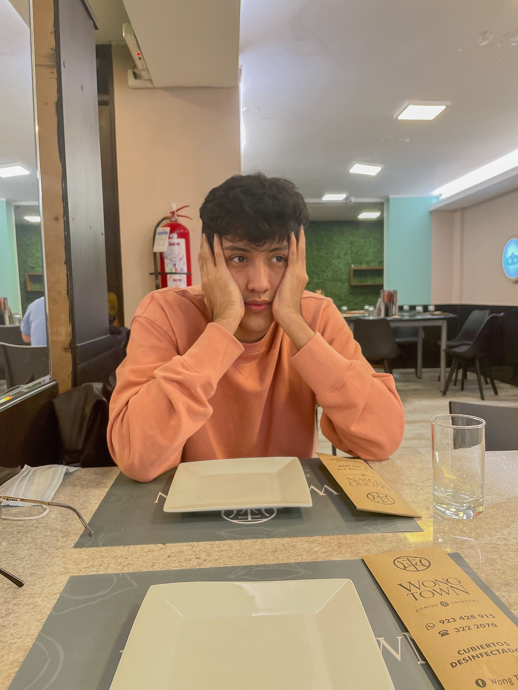

# 
Informe de Trabajo Final

## 
Universidad Peruana de Ciencias Aplicadas

  

Ingeniería de Software

Fundamentos de Arquitectura de software - 6327

<strong>Docente:</strong> Jorge Luis Delgado Vite

<strong>Startup:</strong> TinkuyTech

<strong>Producto:</strong> Ñango

<strong>Team members:</strong>

| Nombre                            | Código     |
| --------------------------------- | ---------- |
| Gamarra Vega, Anderson Jose       | u202016154 |
| Nanfuñay Liza, Pedro Jesús        | u202215462 |
| Quijandria Araneda Vicente        | U201822697 |

<strong>Ciclo 2025-02</strong>

# Registro de versiones del informe

| Versión | Fecha | Autor | Descripción de Modificación |
| ------- | ----- | ----- | --------------------------- |
| TB1 | 06/09/2025 | TinkuyTech | Redación de los capítulos:   Capítulo I: Introducción   Capítulo II: Requirements  & Analysis   Capítulo III: Requirements Specification |

# Student Outcomes

### [Capítulo I: Introducción](#capítulo-i-introducción)

- [1.1. Startup Profile](#11-startup-profile)
  - [1.1.1. Descripción de la Startup](#111-descripción-de-la-startup)
  - [1.1.2. Perfiles de integrantes del equipo](#112-perfiles-de-integrantes-del-equipo)
- [1.2. Solution Profile](#12-solution-profile)
  - [1.2.1 Antecedentes y problemática](#121-antecedentes-y-problemática)
  - [1.2.2 Lean UX Process](#122-lean-ux-process)
    - [1.2.2.1. Lean UX Problem Statements](#1221-lean-ux-problem-statements)
    - [1.2.2.2. Lean UX Assumptions](#1222-lean-ux-assumptions)
    - [1.2.2.3. Lean UX Hypothesis Statements](#1223-lean-ux-hypothesis-statements)
    - [1.2.2.4. Lean UX Canvas](#1224-lean-ux-canvas)
- [1.3. Segmentos objetivo](#13-segmentos-objetivo)

### [Capítulo II: Requirements Elicitation & Analysis](#capítulo-ii-requirements-elicitation--analysis)

- [2.1. Competidores](#21-competidores)
- [2.2. Entrevistas](#22-entrevistas)
- [2.3. Needfinding](#23-needfinding)
  - [2.3.1. User Personas](#231-user-personas)
  - [2.3.2. User Task Matrix](#232-user-task-matrix)
  - [2.3.3. User Journey Mapping](#233-user-journey-mapping)
  - [2.3.4. Empathy Mapping](#234-empathy-mapping)
  - [2.3.5. As-is Scenario Mapping](#235-as-is-scenario-mapping)

### [Capítulo III: Requirements Specification](#capítulo-iii-requirements-specification)

- [3.1. To-Be Scenario Mapping](#31-to-be-scenario-mapping)
- [3.2. User Stories](#32-user-stories)
- [3.3. Impact Mapping](#33-impact-mapping)
- [3.4. Product Backlog](#34-product-backlog)

# Capítulo I: Introducción

## 1.1. Startup Profile

En esta sección se describen los detalles del problema que buscamos resolver.  
Se detalla el perfil de la startup, el mercado objetivo, y se presentan la misión y visión.  
Asimismo, se expone una visión atractiva del equipo, resaltando su potencial en función de las habilidades y capacidades de cada integrante.

### 1.1.1. Descripción de la Startup

### 1.1.2. Perfiles de integrantes del equipo

- **Anderson Jose Gamarra Vega:**

**Descripción:**  
Mi nombre es Anderson Jose Gamarra Vega, tengo 25 años , estudiante de Ingeniería de Software. Desde siempre he sentido una gran pasión por la tecnología, pero me decanto especialmente por el desarrollo de software, pues me fascina aprender nuevos lenguajes de programación, diseñar soluciones digitales y afrontar retos mediante código. Esta inclinación hacia el software fue lo que me motivó a elegir esta carrera, y actualmente estoy profundizando en áreas como backend, arquitectura de software, metodologías agile.

- **Pedro Jesús Nanfuñay Liza:**

**Descripción:**  
Mi nombre es Pedro Jesús Nanfuñay Liza, tengo 20 años y soy estudiante de la carrera de Ingeniería de Software. Me considero una persona creativa, responsable, perseverante y siempre dispuesto a trabajar en equipo. Tengo conocimientos en varios lenguajes de programación como C++, Java y Python; en el desarrollo web con frameworks Angular y Primevue, y en base de datos relacionales y no relacionales como SQL y MongoDB. Espero aportar de manera positiva al equipo y cumplir con los objetivos establecidos.

 

- **Vicente Quijandria Araneda:**

**Descripción:**  
Mi nombre es Vicente Quijandria Araneda, estudio la carrera de Ingeniería de Software en la UPC. Me gusta el fútbol, surf, buceo y la tecnología.
Tengo conocimientos en lenguajes de programación como Java y Python; en el desarrollo web con frameworks React y Angular, y en base de datos relacionales y no relacionales como SQL y MongoDB. Soy una persona que siempre busca aprender nuevos conocimientos que me lleven a convertirme en un gran profesional y así poder cumplir mis metas cada día.

- **Samuel Ignacio Valera Garces:**

**Descripción:**  
Hola, mi nombre es Samuel, estudiante de la carrera de Ingeniería de software. Me considero una persona responsable, empática y con adaptación rápida al trabajo en equipo. Cuento con conocimiento en diversos lenguajes de programación. Mi objetivo a futuro es utilizar la tecnología para el desarrollo de aplicaciones que necesite la sociedad en el día a día. En mis tiempos libres, me gusta practicar guitarra y leer.

.png)
git clean -n
 

## 1.2. Solution Profile

### 1.2.1 Antecedentes y problemática

### 1.2.2 Lean UX Process.

#### 1.2.2.1. Lean UX Problem Statements

Nuestro servicio de movilidad compartida para estudiantes universitarios fue diseñado para garantizar un desplazamiento que garantice la seguridad, accesibilidad y economía de los estudiantes.

Hemos observado que el sistema de transporte público e informal actual no cumple con estos objetivos, lo que está causando altos niveles de inseguridad y sentimientos negativos como temor y estrés en los estudiantes universitarios, quienes se ven expuestos diariamente a robos, asaltos y extorsiones.

Actualmente, muchos estudiantes optan por alternativas riesgosas o costosas, lo que incrementa su exposición a la delincuencia, reduce su libertad de movilización y afecta negativamente su calidad de vida y rendimiento académico.

¿Cómo podríamos mejorar nuestro servicio de movilidad compartida para que los estudiantes universitarios tengan una solución efectiva para conectar con compañeros verificados y optimizar sus rutas diarias garantizando la confianza y la protección en sus desplazamientos?

#### 1.2.2.2. Lean UX Assumptions

**Business Assumptions:**

1. Creemos que nuestros clientes necesitan una aplicación que les permita movilizarse de forma segura, confiable y económica, compartiendo viajes con otros estudiantes verificados.

2. Estas necesidades pueden cubrirse mediante una aplicación que integre validación de usuarios, rutas seguras, y un sistema de reparto de gastos entre pasajeros.

3. Nuestros clientes iniciales serán estudiantes universitarios que cuenten o no con vehículo propio, y que necesiten transportarse de manera segura.

4. El valor más importante que se espera de nuestro servicio es la seguridad durante los traslados, seguida de la accesibilidad económica y confianza entre usuarios.

5. Nuestros clientes también pueden obtener beneficios adicionales como la reducción de costos al compartir viajes, y mayor confianza y tranquilidad al trasladarse con compañeros verificados y seguimiento de su trayecto en tiempo real.

6. Planeamos adquirir la mayoría de nuestros usuarios mediante campañas en redes sociales y eventos académicos.

7. Nuestra competencia directa son los servicios de taxi tradicionales y aplicaciones de movilidad, pero estas no garantizan seguridad ni conexión exclusiva entre estudiantes.

8. Superaremos a la competencia ofreciendo una comunidad cerrada de usuarios verificados, opciones de viaje compartido y evaluación de rutas seguras.

9. El mayor riesgo de nuestro producto es la desconfianza inicial en el uso compartido del transporte con desconocidos.

10. Este riesgo será mitigado mediante perfiles verificados, calificaciones por viaje y soporte de emergencia en la aplicación.

11. La confianza en la plataforma aumentará con el tiempo gracias a la validación de usuarios y experiencias positivas.

12. La satisfacción del cliente también se podrá mejorar mediante la integración de un sistema de soporte.

**User Assumptions:**

1. **¿Quién es el usuario?**  
Estudiantes universitarios (como pasajeros o conductores) que necesitan trasladarse hacia sus instituciones educativas de forma segura y económica.

2. **¿Dónde encaja nuestro producto en su vida?**  
En su rutina diaria, cuando deben movilizarse a las clases universitarias, especialmente en horarios de alto riesgo.

3. **¿Qué problemas tiene nuestro producto y cómo se pueden resolver?**  
Al tratarse de un nuevo sistema, los usuarios podrían tener dudas sobre la seguridad y confiabilidad del servicio. Para resolverlo, se harán campañas informativas, se promoverán testimonios, y se establecerán protocolos de seguridad visibles desde el primer uso.

4. **¿Cuándo y cómo es usado nuestro producto?**  
ÑanGo será utilizado antes de clases para coordinar viajes, compartir rutas y gastos. La plataforma permitirá programar viajes con antelación y coordinar trayectos similares con compañeros.

5. **¿Qué características son importantes?**  
Verificación de identidad, calificación de usuarios, sistema de pago compartido, coordinar horarios de viajes y rutas seguras, y registro de detalle del trayecto.

6. **¿Cómo debe verse nuestro producto y cómo debe comportarse?**  
Debe tener una interfaz juvenil, amigable y confiable, con diseño intuitivo y botones de acción rápida. Debe responder con fluidez y ofrecer información clara sobre seguridad y confiabilidad del viaje.

**Features:**

- Visualización de rutas y horarios disponibles para facilitar la planificación de los viajes.

- Notificaciones instantáneas sobre llegada, cancelaciones o cambios.

- Sistema de verificación.

- Administración eficiente de vehículos.

- Chat interno entre usuarios verificados para coordinar viajes.

- Calificaciones y comentarios entre pasajeros y conductores.

- Historial de viajes y registro de gastos compartidos.

- Soporte técnico constante y actualizaciones de sistema para mejorar el rendimiento y la seguridad.

#### 1.2.2.3. Lean UX Hypothesis Statements

#### 1.2.2.4. Lean UX Canvas

## 1.3. Segmentos Objetivo

# Capítulo II: Requirements Elicitation & Analysis

## 2.1. Competidores

## 2.2. Entrevistas

### 2.2.1 Diseño de Entrevistas

#### Objetivos

Recoger informacion sobre las necesidades , expectativas y posibles preocupaciones de los estudiantes y familiares que estarian interesados de ofrecer servicios de tranporte (como un taxi compartido).

#### Preguntas

#### Estudiante con vehiculo

##### Datos basicos

- ¿Nombre,Edad y carrera?
- ¿Conduces a la universidad? ¿Con qué frecuencia?

##### Transporte compartido

- ¿Has pensado en llevar a otros estudiantes?
- ¿Te incomodaría compartir tu auto? ¿Por qué?

##### Sobre la app

- ¿Qué funciones te parecen esenciales?
- ¿Qué medidas de seguridad te darían confianza?
- ¿Aceptarías compartir tu ruta o horario?
- ¿Preferirías elegir a los pasajeros o que sea automático?
- ¿Qué tipo de pago prefieres?

##### Cierre

- ¿Probarías la app cuando este disponible?
- ¿Te gustaría participar en futuras pruebas?

#### Estudiante sin vehiculo

##### Datos básicos

- ¿Edad y carrera?
- ¿Cómo llegas a la universidad normalmente?
- ¿Cuánto te toma el trayecto?

##### Interés en el servicio

- ¿Te interesaría usar un servicio de transporte compartido con otros estudiantes?
- ¿Qué te haría sentir más seguro al usarlo?

##### Sobre la app

- ¿Qué funciones te gustaría que tenga?
- ¿Qué tipo de pago preferirías?
- ¿Preferirías elegir al conductor o que sea automático?

##### Cierre

- ¿Probarías la app cuando este disponible?
- ¿Te gustaría participar en futuras encuestas o pruebas?

### 2.2.2 Registro de Entrevistas

**Entrevistas para el Segmento Objetivo 1 - Estudiante con vehículo:**

<table border="1">
  <tr>
    <th>Entrevista</th>
    <td>2</td>
    <th>Nombre</th>
    <td>Ariana Martinez</td>
  </tr>
  <tr>
    <th>Edad</th>
    <td>24</td>
    <th>Distrito</th>
    <td>Santiago de Surco, Lima</td>
  </tr>
  <tr>
    <th>Captura de la entrevista:
      
    </th>
    <td colspan="3">
      Ariana es una estudiante universitaria de la UPC, propietaria de un vehículo privado,
      que se desplaza frecuentemente desde su casa hasta la universidad.  
      Ella considera que compartir su vehículo con otros estudiantes es una buena idea para reducir los costos de transporte y hacer nuevas amistades.
      Sin embargo, tiene preocupaciones sobre la seguridad personal y la verificación de identidad,
      por lo que considera importante que una plataforma como la nuestra presente medidas de seguridad estrictas que verifiquen la identidad de cada pasajero y conductor.
    </td>
  </tr>
  <tr>
    <th>URL de la grabación</th>
    <td colspan="3">
      <a href="https://upcedupe-my.sharepoint.com/:v:/g/personal/u202111952_upc_edu_pe/EZd3GcGkxvNDl_7tiJOaSZEBrANwpg_4jDmEdm1lr_EfXA?e=IZMgVf&nav=eyJyZWZlcnJhbEluZm8iOnsicmVmZXJyYWxBcHAiOiJTdHJlYW1XZWJBcHAiLCJyZWZlcnJhbFZpZXciOiJTaGFyZURpYWxvZy1MaW5rIiwicmVmZXJyYWxBcHBQbGF0Zm9ybSI6IldlYiIsInJlZmVycmFsTW9kZSI6InZpZXcifX0%3D">
        Link a la entrevista
      </a>
    </td>
  </tr>
  <tr>
    <th>Timing</th>
    <td colspan="3">00:00 – fin</td>
  </tr>
</table>

**Entrevistas para el Segmento Objetivo 2 - Estudiante sin vehículo:**

<table border="1">
  <tr>
    <th>Entrevista</th>
    <td>1</td>
    <th>Nombre</th>
    <td>Álvaro Urbina</td>
  </tr>
  <tr>
    <th>Edad</th>
    <td>21</td>
    <th>Distrito</th>
    <td>Comas</td>
  </tr>
  <tr>
    <th>Captura de la entrevista: </th>
    <td colspan="3">
        Álvaro Urbina es un estudiante universitario de 21 años que estudia la carrera de Ingeniería Ambiental en la Universidad Nacional Tecnológica del Sur. ÉL nos comenta su proceso de transporte hacia su centro de estudios conformado por transportes informales y formales con un tiempo aproximado de 3 horas. Considera que una aplicación con servicio de transporte compartido con otros estudiantes es conveniente para él para llegar más rápido a su centro de estudios y conocer a más estudiantes. Además, sugiere la implementación de funciones de seguridad para poder compartir su ubicación y ruta de viaje asignado con algún familiar o apoderado para sentirse más tranquilo. Así mismo, prefiere realizar los pagos por servicios como Yape por su practicidad; y prefiere que el sistema eliga a los conductores automáticamente para conocer nuevas personas. En conclusión, Alvaro considera que le resulta interesante el servicio de transporte compartido que ofrece Ñango para transportarse a su centro de estudios y está dispuesto a colaborar en futuras pruebas y encuestas de la misma.
    </td>
  </tr>
  <tr>
    <th>URL de la grabación</th>
    <td colspan="3">
      <a href="https://upcedupe-my.sharepoint.com/:v:/g/personal/u202215462_upc_edu_pe/EYC-VVwDoY9Orw2tatR9QxQB11ebyRm_vkseBp2bTElU-w?e=X5KQgN&nav=eyJyZWZlcnJhbEluZm8iOnsicmVmZXJyYWxBcHAiOiJTdHJlYW1XZWJBcHAiLCJyZWZlcnJhbFZpZXciOiJTaGFyZURpYWxvZy1MaW5rIiwicmVmZXJyYWxBcHBQbGF0Zm9ybSI6IldlYiIsInJlZmVycmFsTW9kZSI6InZpZXcifX0%3D">
        https://upcedupe-my.sharepoint.com/:v:/g/personal/u202215462_upc_edu_pe/EYC-VVwDoY9Orw2tatR9QxQB11ebyRm_vkseBp2bTElU-w?e=X5KQgN&nav=eyJyZWZlcnJhbEluZm8iOnsicmVmZXJyYWxBcHAiOiJTdHJlYW1XZWJBcHAiLCJyZWZlcnJhbFZpZXciOiJTaGFyZURpYWxvZy1MaW5rIiwicmVmZXJyYWxBcHBQbGF0Zm9ybSI6IldlYiIsInJlZmVycmFsTW9kZSI6InZpZXcifX0%3D
      </a>
    </td>
  </tr>
  <tr>
   <th>Timing</th>
    <td colspan="3">
        00:00 - 3:55
    </td>
  </tr>
</table>

### 2.2.3. Análisis de entrevistas

## 2.3. Needfinding

### 2.3.1. User Persons

### 2.3.2. User Task Matrix

### 2.3.3 User Journey Mapping

### 2.3.4. Empathy Mapping

### 2.3.5. As-is Scenario Mapping

### Estudiante pasajero

### Estudiante conductor

### Familiar de estudiante

# Capítulo III: Requirements Specification

### 3.1. To-be Scenario Mapping

### Estudiante pasajero

### Estudiante conductor

### Familiar de estudiante

### 3.2 User Stories

### 3.3 Impact Map

### 3.4. Product Backlog