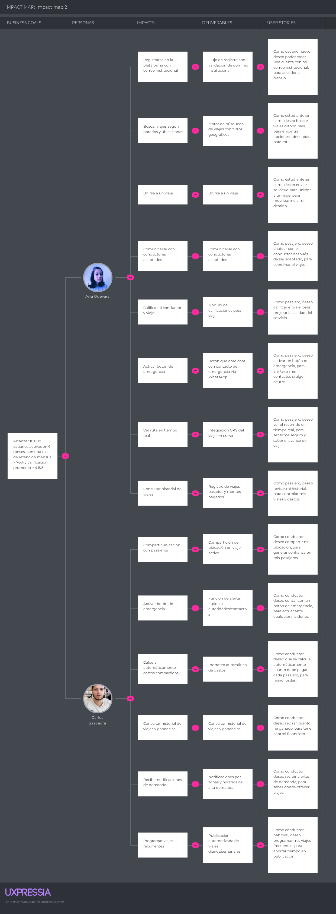

# 
Informe de Trabajo Final

## 
Universidad Peruana de Ciencias Aplicadas

  

Ingeniería de Software

Fundamentos de Arquitectura de software - 6327

<strong>Docente:</strong> Jorge Luis Delgado Vite

<strong>Startup:</strong> TinkuyTech

<strong>Producto:</strong> Ñango

<strong>Team members:</strong>

| Nombre                            | Código     |
| --------------------------------- | ---------- |
| Gamarra Vega, Anderson Jose       | u202016154 |
| Nanfuñay Liza, Pedro Jesús        | u202215462 |
| Quijandria Araneda Vicente        | U201822697 |
| Hallasi Saravia, Miguel Angel     | U202312391 |
| Valera Garcés, Samuel Ignacio     | U202111952 |

<strong>Ciclo 2025-02</strong>

# Registro de versiones del informe

| Versión | Fecha | Autor | Descripción de Modificación |
| ------- | ----- | ----- | --------------------------- |
| TB1 | 06/09/2025 | TinkuyTech | Redación de los capítulos:   Capítulo I: Introducción   Capítulo II: Requirements  & Analysis   Capítulo III: Requirements Specification |

# Student Outcomes

| Criterio específico | Acciones realizadas | Conclusiones |
|---------------------|---------------------|--------------|
| **Actualiza conceptos y conocimientos necesarios para su desarrollo profesional y en especial para su proyecto en soluciones de software.** | **Gamarra Vega, Anderson José** - Redacté el Lean UX Canvas, relacionando hipótesis y supuestos con los objetivos del producto, lo que me permitió afianzar mis conocimientos en metodologías ágiles de diseño.  - Contribuí en la construcción del Product Backlog, aplicando técnicas de priorización que me ayudaron a fortalecer mis competencias en gestión de requisitos y planificación de software.  **Nanfuñay Liza, Pedro Jesús** - Redacté puntos esenciales para el desarrollo del presente proyecto como el Lean UX Assumptions, Empathy Maps y User Stories, aplicando conocimientos adquiridos de manera eficiente y clara, y buenas prácticas que me permitieron actualizar mis conocimientos y fortalecer mis competencias en el desarrollo de software.  **Quijandria Araneda, Vicente** - Desarrollé la sección de antecedentes y problemática, aplicando herramientas de análisis para contextualizar el proyecto. - Participé en la redacción de User Stories, lo que me permitió reforzar mi capacidad de transformar hallazgos en especificaciones claras y accionables.  **Hallasi Saravia, Miguel Ángel** - Redacté la sección de segmentos objetivo, lo cual me permitió aplicar conceptos de segmentación y análisis de usuarios. - Participé activamente en entrevistas y en la construcción del Impact Map, afianzando mis conocimientos en la identificación de métricas de valor y validación de usuarios.  **Valera Garcés, Samuel Ignacio** - Redacté la descripción de la startup y documenté escenarios As-Is y To-Be, lo que me ayudó a profundizar en el análisis de procesos y a fortalecer mis competencias en modelado de escenarios. | Cada integrante actualizó y aplicó conceptos fundamentales en Lean UX, análisis de usuarios y especificación de requisitos. El equipo en conjunto demostró que la aplicación práctica de estos conocimientos fortaleció sus competencias profesionales y mejoró la calidad del proyecto. |
| **Reconoce la necesidad del aprendizaje permanente para el desempeño profesional y el desarrollo de proyectos en soluciones de software.** | **Gamarra Vega, Anderson José** - Al elaborar el Lean UX Canvas y priorizar el backlog, comprendí la importancia de actualizar de manera constante mis conocimientos en análisis de producto y planificación, reconociendo que el aprendizaje continuo es clave para mejorar mi desempeño profesional.  **Nanfuñay Liza, Pedro Jesús** - Al redactar este informe comprendí la importancia de actualizar constantemente los conocimientos que adquiero, ya que es un aspecto fundamental para mejorar mis capacidades, desempeño profesional y en el desarrollo de proyectos de soluciones de software.  **Quijandria Araneda, Vicente** - Al redactar los antecedentes y problemática y participar en la definición de historias de usuario, entendí que debo mantenerme actualizado en técnicas de análisis y documentación de requisitos para elevar mi desempeño en futuros proyectos.  **Hallasi Saravia, Miguel Ángel** - Al elaborar los segmentos objetivo, realizar entrevistas y desarrollar el Impact Map, comprendí que el aprendizaje permanente es esencial para perfeccionar mis competencias en validación de usuarios y métricas de impacto.  **Valera Garcés, Samuel Ignacio** - Al redactar la descripción de la startup y los escenarios As-Is/To-Be, entendí la necesidad de fortalecer constantemente mis conocimientos en mapeo de procesos y comunicación de resultados, reconociendo que el aprendizaje continuo es esencial para mi desarrollo profesional. | El equipo reconoció que el aprendizaje permanente es un pilar para el crecimiento profesional y para la mejora continua en el desarrollo de proyectos de software. La experiencia les permitió reafirmar la importancia de seguir investigando, aplicando nuevas técnicas y adaptando buenas prácticas a futuros retos. |

# Index

### [Capítulo I: Introducción](#capítulo-i-introducción)

- [1.1. Startup Profile](#11-startup-profile)
  - [1.1.1. Descripción de la Startup](#111-descripción-de-la-startup)
  - [1.1.2. Perfiles de integrantes del equipo](#112-perfiles-de-integrantes-del-equipo)
- [1.2. Solution Profile](#12-solution-profile)
  - [1.2.1 Antecedentes y problemática](#121-antecedentes-y-problemática)
  - [1.2.2 Lean UX Process](#122-lean-ux-process)
    - [1.2.2.1. Lean UX Problem Statements](#1221-lean-ux-problem-statements)
    - [1.2.2.2. Lean UX Assumptions](#1222-lean-ux-assumptions)
    - [1.2.2.3. Lean UX Hypothesis Statements](#1223-lean-ux-hypothesis-statements)
    - [1.2.2.4. Lean UX Canvas](#1224-lean-ux-canvas)
- [1.3. Segmentos objetivo](#13-segmentos-objetivo)

### [Capítulo II: Requirements Elicitation & Analysis](#capítulo-ii-requirements-elicitation--analysis)

- [2.1. Competidores](#21-competidores)
- [2.2. Entrevistas](#22-entrevistas)
- [2.3. Needfinding](#23-needfinding)
  - [2.3.1. User Personas](#231-user-personas)
  - [2.3.2. User Task Matrix](#232-user-task-matrix)
  - [2.3.3. User Journey Mapping](#233-user-journey-mapping)
  - [2.3.4. Empathy Mapping](#234-empathy-mapping)
  - [2.3.5. As-is Scenario Mapping](#235-as-is-scenario-mapping)

### [Capítulo III: Requirements Specification](#capítulo-iii-requirements-specification)

- [3.1. To-Be Scenario Mapping](#31-to-be-scenario-mapping)
- [3.2. User Stories](#32-user-stories)
- [3.3. Impact Mapping](#33-impact-mapping)
- [3.4. Product Backlog](#34-product-backlog)

# Capítulo I: Introducción

## 1.1. Startup Profile

En esta sección se describen los detalles del problema que buscamos resolver.  
Se detalla el perfil de la startup, el mercado objetivo, y se presentan la misión y visión.  
Asimismo, se expone una visión atractiva del equipo, resaltando su potencial en función de las habilidades y capacidades de cada integrante.

### 1.1.1. Descripción de la Startup

TinkuyTech es una startup peruana dedicada a fortalecer la seguridad en el transporte de los estudiantes. Nuestro producto principal, ÑanGo, es una aplicación web diseñada específicamente para la comunidad universitaria. A través de esta plataforma, los estudiantes que cuentan con movilidad propia pueden conectarse con quienes necesitan transporte hacia la universidad, facilitando la coordinación de rutas, el reparto de gastos y la optimización del tiempo de viaje. De esta forma, promovemos una alternativa más segura, accesible y eficiente para la vida estudiantil.

La aplicación ofrece herramientas interactivas que permiten visualizar rutas compartidas, coordinar horarios, gestionar costos y acceder a los perfiles de conductores y pasajeros, generando confianza y transparencia. Al integrar estas funciones, ÑanGo se convierte en una solución práctica y confiable para estudiantes y familiares que priorizan seguridad y comodidad en sus traslados diarios.

--- 
Misión

Nuestra misión es transformar la movilidad estudiantil en el Perú mediante una solución tecnológica que facilite el acceso a un transporte compartido, seguro, económico y solidario. Queremos impulsar la seguridad de los estudiantes y contribuir a un futuro más sostenible, conectado y confiable.

--- 
Visión

Nuestra visión es consolidarnos como la startup referente en seguridad de transporte universitario en el Perú. Aspiramos a construir una comunidad donde los estudiantes puedan acceder de manera sencilla a un sistema de movilidad eficiente, confiable y colaborativo.

### 1.1.2. Perfiles de integrantes del equipo

- **Anderson Jose Gamarra Vega:**

**Descripción:**  
Mi nombre es Anderson Jose Gamarra Vega, tengo 25 años , estudiante de Ingeniería de Software. Desde siempre he sentido una gran pasión por la tecnología, pero me decanto especialmente por el desarrollo de software, pues me fascina aprender nuevos lenguajes de programación, diseñar soluciones digitales y afrontar retos mediante código. Esta inclinación hacia el software fue lo que me motivó a elegir esta carrera, y actualmente estoy profundizando en áreas como backend, arquitectura de software, metodologías agile.

- **Pedro Jesús Nanfuñay Liza:**

**Descripción:**  
Mi nombre es Pedro Jesús Nanfuñay Liza, tengo 20 años y soy estudiante de la carrera de Ingeniería de Software. Me considero una persona creativa, responsable, perseverante y siempre dispuesto a trabajar en equipo. Tengo conocimientos en varios lenguajes de programación como C++, Java y Python; en el desarrollo web con frameworks Angular y Primevue, y en base de datos relacionales y no relacionales como SQL y MongoDB. Espero aportar de manera positiva al equipo y cumplir con los objetivos establecidos.

 

- **Vicente Quijandria Araneda:**

**Descripción:**  
Mi nombre es Vicente Quijandria Araneda, estudio la carrera de Ingeniería de Software en la UPC. Me gusta el fútbol, surf, buceo y la tecnología.
Tengo conocimientos en lenguajes de programación como Java y Python; en el desarrollo web con frameworks React y Angular, y en base de datos relacionales y no relacionales como SQL y MongoDB. Soy una persona que siempre busca aprender nuevos conocimientos que me lleven a convertirme en un gran profesional y así poder cumplir mis metas cada día.

- **Samuel Ignacio Valera Garces:**

**Descripción:**  
Hola, mi nombre es Samuel, estudiante de la carrera de Ingeniería de software. Me considero una persona responsable, empática y con adaptación rápida al trabajo en equipo. Cuento con conocimiento en diversos lenguajes de programación. Mi objetivo a futuro es utilizar la tecnología para el desarrollo de aplicaciones que necesite la sociedad en el día a día. En mis tiempos libres, me gusta practicar guitarra y leer.

- **Miguel Hallasi Saravia:**

**Descripción:**  
Soy Miguel Hallasi, estudiante del sexto ciclo de la carrera de Ingeniería de Software. Me gusta el aprendizaje continuo y adquirir nuevas experiencias.

## 1.2. Solution Profile

En esta sección se detallan los segmentos de descripición de nuestra solución de software, sus características de valor y las estrategias de monetización.

**Product Name:**

Optamos por el nombre Ñango porque proviene de la palabra quechua “ñan”, que significa camino, y “go”, que remite a la acción de ir o avanzar. Esta combinación transmite la esencia de la aplicación: facilitar el desplazamiento de los estudiantes de manera segura, práctica y colaborativa. El nombre refleja cercanía con la cultura peruana y, al mismo tiempo, proyecta modernidad y dinamismo, valores que nuestra plataforma busca ofrecer a sus usuarios.

### 1.2.1 Antecedentes y problemática

En los últimos años, la situación del transporte en el Perú se ha visto marcada por altos niveles de inseguridad que afectan tanto a pasajeros como a conductores. Este contexto resulta especialmente delicado para los estudiantes universitarios, quienes suelen ser víctimas de robos y asaltos en los alrededores de sus centros de estudio. Asimismo, la presencia de transporte informal y la práctica de cobro de “cupos” a choferes limitan la disponibilidad de servicios confiables, generando incertidumbre y restringiendo la movilidad diaria.

Frente a esta realidad, surge la necesidad de una alternativa tecnológica que garantice un traslado más seguro y accesible para los estudiantes. Es en este escenario que se plantea ÑanGo, una plataforma de movilidad compartida enfocada en la comunidad universitaria, la cual busca conectar a estudiantes con vehículo propio con aquellos que requieren transporte. Con esta solución, se busca optimizar costos, reducir riesgos asociados a la inseguridad y generar confianza a través de perfiles verificados y medidas de protección.

Para analizar la problemática, se empleó la técnica de las 5 “W” y 2 “H”:

**WHAT – ¿Cuál es el problema?**
Los servicios de transporte actuales presentan deficiencias en términos de seguridad y confianza. Los estudiantes se enfrentan a delitos frecuentes como robos, asaltos y acoso, lo que genera un ambiente de vulnerabilidad. Existe una carencia de opciones que combinen economía y seguridad en los traslados hacia las universidades.

**WHEN – ¿Cuándo ocurre el problema?**
La problemática se presenta de forma cotidiana, sobre todo en horas punta, coincidiendo con los horarios de ingreso y salida de las universidades. Estos momentos de congestión son aprovechados por delincuentes en zonas cercanas a los centros educativos.

**WHERE – ¿Dónde surge el problema y dónde se usa el producto?**
El problema es más visible en las calles de Lima Metropolitana y otras ciudades universitarias donde predominan los taxis informales y la inseguridad. Los estudiantes podrán usar ÑanGo desde sus casas, universidades u otros espacios con conexión a internet, para coordinar viajes hacia sus centros de estudio y compartir rutas con compañeros de confianza.

**WHO – ¿Quiénes están involucrados?**
Los principales afectados son los estudiantes universitarios, aunque también se incluye a familiares que pueden actuar como choferes de confianza. Los usuarios de la plataforma serán tanto pasajeros que buscan un transporte seguro, como estudiantes que ofrecen sus vehículos para compartir gastos y mejorar la movilidad.

**WHY – ¿Por qué ocurre el problema?**
Las causas principales son la informalidad en el servicio de transporte, la falta de regulación eficiente y la limitada presencia de sistemas tecnológicos que garanticen la seguridad de los pasajeros. Además, los altos costos del transporte privado llevan a los estudiantes a optar por alternativas más riesgosas.

**HOW – ¿Cómo se utiliza la solución?**
ÑanGo será utilizada en situaciones de alta demanda de transporte, especialmente en horas punta. Los estudiantes coordinarán viajes compartidos, reducirán gastos al dividir costos y contarán con perfiles verificados que les brinden mayor confianza y seguridad en el servicio.

**HOW MUCH – Sustento estadístico**
De acuerdo con datos de la Policía Nacional del Perú y reportes del Ministerio del Interior, Lima Metropolitana registra elevados índices de robos y asaltos en el transporte público e informal. Estas cifras evidencian la urgencia de implementar soluciones seguras e innovadoras para la comunidad estudiantil, reforzando la necesidad de una plataforma como ÑanGo.
### 1.2.2 Lean UX Process.

#### 1.2.2.1. Lean UX Problem Statements

Nuestro servicio de movilidad compartida para estudiantes universitarios fue diseñado para garantizar un desplazamiento que garantice la seguridad, accesibilidad y economía de los estudiantes.

Hemos observado que el sistema de transporte público e informal actual no cumple con estos objetivos, lo que está causando altos niveles de inseguridad y sentimientos negativos como temor y estrés en los estudiantes universitarios, quienes se ven expuestos diariamente a robos, asaltos y extorsiones.

Actualmente, muchos estudiantes optan por alternativas riesgosas o costosas, lo que incrementa su exposición a la delincuencia, reduce su libertad de movilización y afecta negativamente su calidad de vida y rendimiento académico.

¿Cómo podríamos mejorar nuestro servicio de movilidad compartida para que los estudiantes universitarios tengan una solución efectiva para conectar con compañeros verificados y optimizar sus rutas diarias garantizando la confianza y la protección en sus desplazamientos?

#### 1.2.2.2. Lean UX Assumptions

**Business Assumptions:**

1. Creemos que nuestros clientes necesitan una aplicación que les permita movilizarse de forma segura, confiable y económica, compartiendo viajes con otros estudiantes verificados.

2. Estas necesidades pueden cubrirse mediante una aplicación que integre validación de usuarios, rutas seguras, y un sistema de reparto de gastos entre pasajeros.

3. Nuestros clientes iniciales serán estudiantes universitarios que cuenten o no con vehículo propio, y que necesiten transportarse de manera segura.

4. El valor más importante que se espera de nuestro servicio es la seguridad durante los traslados, seguida de la accesibilidad económica y confianza entre usuarios.

5. Nuestros clientes también pueden obtener beneficios adicionales como la reducción de costos al compartir viajes, y mayor confianza y tranquilidad al trasladarse con compañeros verificados y seguimiento de su trayecto en tiempo real.

6. Planeamos adquirir la mayoría de nuestros usuarios mediante campañas en redes sociales y eventos académicos.

7. Nuestra competencia directa son los servicios de taxi tradicionales y aplicaciones de movilidad, pero estas no garantizan seguridad ni conexión exclusiva entre estudiantes.

8. Superaremos a la competencia ofreciendo una comunidad cerrada de usuarios verificados, opciones de viaje compartido y evaluación de rutas seguras.

9. El mayor riesgo de nuestro producto es la desconfianza inicial en el uso compartido del transporte con desconocidos.

10. Este riesgo será mitigado mediante perfiles verificados, calificaciones por viaje y soporte de emergencia en la aplicación.

11. La confianza en la plataforma aumentará con el tiempo gracias a la validación de usuarios y experiencias positivas.

12. La satisfacción del cliente también se podrá mejorar mediante la integración de un sistema de soporte.

**User Assumptions:**

1. **¿Quién es el usuario?**  
Estudiantes universitarios (como pasajeros o conductores) que necesitan trasladarse hacia sus instituciones educativas de forma segura y económica.

2. **¿Dónde encaja nuestro producto en su vida?**  
En su rutina diaria, cuando deben movilizarse a las clases universitarias, especialmente en horarios de alto riesgo.

3. **¿Qué problemas tiene nuestro producto y cómo se pueden resolver?**  
Al tratarse de un nuevo sistema, los usuarios podrían tener dudas sobre la seguridad y confiabilidad del servicio. Para resolverlo, se harán campañas informativas, se promoverán testimonios, y se establecerán protocolos de seguridad visibles desde el primer uso.

4. **¿Cuándo y cómo es usado nuestro producto?**  
ÑanGo será utilizado antes de clases para coordinar viajes, compartir rutas y gastos. La plataforma permitirá programar viajes con antelación y coordinar trayectos similares con compañeros.

5. **¿Qué características son importantes?**  
Verificación de identidad, calificación de usuarios, sistema de pago compartido, coordinar horarios de viajes y rutas seguras, y registro de detalle del trayecto.

6. **¿Cómo debe verse nuestro producto y cómo debe comportarse?**  
Debe tener una interfaz juvenil, amigable y confiable, con diseño intuitivo y botones de acción rápida. Debe responder con fluidez y ofrecer información clara sobre seguridad y confiabilidad del viaje.

**Features:**

- Visualización de rutas y horarios disponibles para facilitar la planificación de los viajes.

- Notificaciones instantáneas sobre llegada, cancelaciones o cambios.

- Sistema de verificación.

- Administración eficiente de vehículos.

- Chat interno entre usuarios verificados para coordinar viajes.

- Calificaciones y comentarios entre pasajeros y conductores.

- Historial de viajes y registro de gastos compartidos.

- Soporte técnico constante y actualizaciones de sistema para mejorar el rendimiento y la seguridad.

#### 1.2.2.3. Lean UX Hypothesis Statements

- Creemos que los estudiantes podrán optimizar su tiempo y reducir costos de transporte si se implementa una funcionalidad que les permita coordinar viajes en grupo hacia la universidad a través de una plataforma que les conecte con otros estudiantes de su misma universidad. Sabremos que hemos tenido éxito cuando el 30% de los estudiantes utilicen regularmente la plataforma para coordinar viajes y que el 25% reporte una disminución en sus gastos de transporte mensual.

- Creemos que los estudiantes reducirán su huella de carbono y contribuirán a la sostenibilidad si proporcionamos una opción fácil de coordinar viajes en vehículos compartidos, disminuyendo el número de autos individuales en las rutas comunes hacia las universidades. Sabremos que hemos tenido éxito cuando el 20% de los estudiantes reporten que han preferido la opción de compartir vehículo por encima de usar transporte público o privado.

- Creemos que los estudiantes podrán mejorar la accesibilidad y seguridad en sus traslados si ofrecemos un sistema de calificación y seguimiento de viajes compartidos, lo que proporcionará mayor confianza y control. Sabremos que hemos tenido éxito cuando al menos el 15% de los usuarios reporten mayor confianza y comodidad al utilizar la plataforma, y que el 20% mencionen que el sistema de calificación ha mejorado su experiencia de viaje.

- Creemos que los estudiantes estarán más dispuestos a utilizar la plataforma si esta ofrece perfiles verificados y filtros de coincidencia por universidad o facultad. Sabremos que hemos tenido éxito cuando al menos el 60 % de los usuarios activen la verificación de identidad y el 70 % prefiera viajar con contactos verificados de su misma institución.

- Creemos que la adopción aumentará si se integra un sistema de notificaciones para viajes programados. Sabremos que hemos tenido éxito cuando el 80 % de los trayectos se confirmen con más de 6 horas de anticipación y se reduzca en un 30 % la tasa de cancelaciones de último minuto.

- Creemos que la plataforma será más atractiva si permite compartir gastos automáticamente mediante pagos digitales entre los pasajeros. Sabremos que hemos tenido éxito cuando al menos el 50 % de los viajes registrados utilicen el sistema de pago integrado y el 85 % de los usuarios lo califiquen como fácil y seguro.

#### 1.2.2.4. Lean UX Canvas

## 1.3. Segmentos Objetivo

### **Segmento 1: Estudiantes Conductores**

Este segmento está compuesto por estudiantes universitarios que poseen un vehículo y buscan optimizar sus gastos de transporte.

- **Características Demográficas:**
  - **Edad:** 18 años a más.
  - **Ubicación:** Zonas urbanas de Perú, principalmente Lima.
  - **Nivel Educativo:** Estudiantes universitarios.

---

### **Segmento 2: Estudiantes Pasajeros**

Son estudiantes que no tienen un vehículo propio y necesitan una alternativa de transporte segura y económica para sus traslados a la universidad.

- **Características Demográficas:**
  - **Edad:** 16 años a más.
  - **Ubicación:** Zonas urbanas de Perú.
  - **Nivel Educativo:** Estudiantes universitarios y de institutos superiores.

# Capítulo II: Requirements Elicitation & Analysis

## 2.1. Competidores

<table>
<tbody><tr><th colspan="7" valign="top"><b>Competitive Analysis Landscape</b></th></tr><tr><td colspan="2" rowspan="2">¿Por qué llevar a cabo este análisis?</td><td colspan="5">Escriba en el recuadro la pregunta que busca responder o el objetivo de este análisis.</td></tr><tr><td colspan="5">Para poder comprender mejor el panorama competitivo en el mercado de servicios de transporte para alumnos en Lima, Perú. Identificando fortalezas, debilidades, oportunidades y amenazas de mi startup y sus competidores.</td></tr><tr><td colspan="3">Nuestro Producto / Competidores</td><td colspan="1" valign="top" style="font-weight: bold;">ÑanGo </td><td colspan="1" valign="top" style="font-weight: bold;">GoLadies </td><td colspan="1" valign="top" style="font-weight: bold;">Hoop carpool </td><td colspan="1" valign="top" style="font-weight: bold;">BlaBlaCar </td></tr><tr><td colspan="1" rowspan="2">Perfil</td><td colspan="2">Overview</td><td colspan="1" valign="top"> Aplicación web diseñada específicamente para los estudiantes. ÑanGo conecta a estudiantes que cuentan con movilidad propia con aquellos que buscan transporte para ir a la universidad.</td><td colspan="1" valign="top">Go Ladies Perú se dedica a realizar traslados exclusivos a mujeres, niños, personas con discapacidad certificada y adultos mayores con identificación.</td><td colspan="1" valign="top">Hoop Carpool es una empresa de carpooling para empresas. Ofrece a tus empleados y alumnos la opcion de compartir el coche en su dia a dia.</td><td colspan="1" valign="top">BlaBlaCar es una comunidad de usuarios basada en la confianza que conecta a conductores con asientos vacíos y pasajeros que se dirigen a un mismo lugar, para que viajen juntos y compartan el costo.</td></tr><tr><td colspan="2">Ventaja competitiva</td><td colspan="1" valign="top">Movilizacion de forma segura, confiable y económica ademas de compartir viajes solo con estudiantes verificados.</td><td colspan="1" valign="top">Transporte exclusivo de mujeres para mujeres, brindando seguridad y confianza en las usuarias. </td><td colspan="1" valign="top">Enfoque mas orientado a empresas como tambien hacer un impacto al tratar de reducir el uso de vehiculos. </td><td colspan="1" valign="top">Brinda viajes a precios bajos , reconociemiento mediante identificaciones y reservas faciles</td></tr><tr><td colspan="1" rowspan="2">Perfil de Marketing</td><td colspan="2">Mercado objetivo</td><td colspan="1" valign="top">Estudiantes de Universidades en todo Lima.</td><td colspan="1" valign="top">Todas las mujeres de Lima. </td><td colspan="1" valign="top">Personal emprasarial. </td><td colspan="1" valign="top">Todo publico en general. </td></tr><tr><td colspan="2">Estrategias de marketing</td><td colspan="1" valign="top">Promoción y publicidad en redes sociales y anuncios</td><td colspan="1" valign="top">Promoción en redes sociales, anuncios y colaboraciones con influenciadores.</td><td colspan="1" valign="top">Publicidad en redes sociales y anuncios.</td><td colspan="1" valign="top">Publicidad en paginas web.</td></tr><tr><td colspan="1" rowspan="3">Perfil de Producto</td><td colspan="2">Productos &amp; Servicios</td><td colspan="1" valign="top">Brinda servicio de transporte a estudiantes , utilizando vehiculos personales.</td><td colspan="1" valign="top">Brinda servicio de transporte de solo mujeres para mujeres . </td><td colspan="1" valign="top">Brinda servicio de transporte compartido a personal empresarial. </td><td colspan="1" valign="top">Brinda viajes en auto personal y bus compartido a todo publico. </td></tr><tr><td colspan="2">Precios &amp; Costos</td><td colspan="1" valign="top">Tarifa sujeta al conductor con previa coordinacion. </td><td colspan="1" valign="top">Tarifas sujeta al trayecto.</td><td colspan="1" valign="top">Tarifa sujeta a contrato</td><td colspan="1" valign="top">Tarifa sujeta al trayecto.</td></tr><tr><td colspan="2">Canales de distribución (Web y/o Móvil)</td><td colspan="1" valign="top">Aplicación web. </td><td colspan="1" valign="top">Sitio web.</td><td colspan="1" valign="top">Aplicación móvil y sitio web.</td><td colspan="1" valign="top">Aplicacion movil y sitio web.</td><tr></tr><td colspan="1" rowspan="5">Análisis SWOT</td></td></tr><tr><td colspan="2">Fortalezas</td><td colspan="1" valign="top">Seguridad y rapidez al brindar servicio de transportes a estudiantes.</td><td colspan="1" valign="top">Servicio de transporte solo para mujeres. </td><td colspan="1" valign="top">Especializado en servicios de tranporte empresarial.</td><td colspan="1" valign="top">Servicio de transporte para todo publico </td></tr><tr><td colspan="2">Debilidades</td><td colspan="1" valign="top">Dependencia de la disponibilidad de los usuarios. </td><td colspan="1" valign="top">Poca disponibilidad en horario nocturno.</td><td colspan="1" valign="top">Abarca solo empresas y costos altos</td><td colspan="1" valign="top">Poca publicidad y costos altos.
</td></tr><tr><td colspan="2">Oportunidades</td><td colspan="1" valign="top">Mejora la seguridad del transporte de los estudiantes. </td><td colspan="1" valign="top">Mejora la seguridad para las mujeres al transportarse en taxi.</td><td colspan="1" valign="top">Reduccion de autos del personal empresarial. </td><td colspan="1" valign="top">Mejora la seguridad y la confianza al tomar un transporte de viaje extenso.</td></tr><tr><td colspan="2">Amenazas</td><td colspan="1" valign="top">Competencia con servicios de taxi en general. </td><td colspan="1" valign="top">Competencia con servicios de taxi en general.</td><td colspan="1" valign="top">Cantidad minima de contratos. </td><td colspan="1" valign="top">Competencia de otros servicios similares.</td></tr></tbody></table>

### 2.1.2 Estrategia y tacticas frente a competidores

**1. Servicio especializado en la comunidad universitaria:**
- **Exclusividad y confianza:** A diferencia de apps masivas como BlaBlaCar, en ÑanGo solo viajas con otros estudiantes. La verificación con correo institucional crea un círculo de confianza que nos diferencia.

**2. Precios pensados para estudiantes:**
- **Costos compartidos, no tarifas:** Promovemos un modelo donde los conductores comparten gastos, no buscan lucrar. Esto nos hace más económicos que las alternativas.
- **Flexibilidad:** Ofreceremos descuentos para grupos y precios más bajos en horas de poca demanda para adaptarnos al bolsillo del estudiante.

**3. Una red de confianza, no solo de viajes:**
- **La confianza es nuestro pilar:** Nuestra ventaja frente a los taxis es la seguridad. Perfiles completos, reseñas entre compañeros y la opción de compartir tu ruta en tiempo real son la base.
- **Fidelización y comunidad:** Recompensaremos a los mejores conductores y pasajeros, y organizaremos eventos para fortalecer los lazos entre usuarios.

## 2.2. Entrevistas

### 2.2.1 Diseño de Entrevistas

#### Objetivos

Recoger informacion sobre las necesidades , expectativas y posibles preocupaciones de los estudiantes y familiares que estarian interesados de ofrecer servicios de tranporte (como un taxi compartido).

#### Preguntas

#### Estudiante con vehiculo

##### Datos basicos

- ¿Nombre,Edad y carrera?
- ¿Conduces a la universidad? ¿Con qué frecuencia?

##### Transporte compartido

- ¿Has pensado en llevar a otros estudiantes?
- ¿Te incomodaría compartir tu auto? ¿Por qué?

##### Sobre la app

- ¿Qué funciones te parecen esenciales?
- ¿Qué medidas de seguridad te darían confianza?
- ¿Aceptarías compartir tu ruta o horario?
- ¿Preferirías elegir a los pasajeros o que sea automático?
- ¿Qué tipo de pago prefieres?

##### Cierre

- ¿Probarías la app cuando este disponible?
- ¿Te gustaría participar en futuras pruebas?

#### Estudiante sin vehiculo

##### Datos básicos

- ¿Edad y carrera?
- ¿Cómo llegas a la universidad normalmente?
- ¿Cuánto te toma el trayecto?

##### Interés en el servicio

- ¿Te interesaría usar un servicio de transporte compartido con otros estudiantes?
- ¿Qué te haría sentir más seguro al usarlo?

##### Sobre la app

- ¿Qué funciones te gustaría que tenga?
- ¿Qué tipo de pago preferirías?
- ¿Preferirías elegir al conductor o que sea automático?

##### Cierre

- ¿Probarías la app cuando este disponible?
- ¿Te gustaría participar en futuras encuestas o pruebas?

### 2.2.2 Registro de Entrevistas

**Entrevistas para el Segmento Objetivo 1 - Estudiante con vehículo:**

<table border="1">
  <tr>
    <th>Entrevista</th>
    <td>2</td>
    <th>Nombre</th>
    <td>Ariana Martinez</td>
  </tr>
  <tr>
    <th>Edad</th>
    <td>24</td>
    <th>Distrito</th>
    <td>Santiago de Surco, Lima</td>
  </tr>
  <tr>
    <th>Captura de la entrevista:
      
    </th>
    <td colspan="3">
      Ariana es una estudiante universitaria de la UPC, propietaria de un vehículo privado,
      que se desplaza frecuentemente desde su casa hasta la universidad.  
      Ella considera que compartir su vehículo con otros estudiantes es una buena idea para reducir los costos de transporte y hacer nuevas amistades.
      Sin embargo, tiene preocupaciones sobre la seguridad personal y la verificación de identidad,
      por lo que considera importante que una plataforma como la nuestra presente medidas de seguridad estrictas que verifiquen la identidad de cada pasajero y conductor.
    </td>
  </tr>
  <tr>
    <th>URL de la grabación</th>
    <td colspan="3">
      <a href="https://upcedupe-my.sharepoint.com/:v:/g/personal/u202111952_upc_edu_pe/EZd3GcGkxvNDl_7tiJOaSZEBrANwpg_4jDmEdm1lr_EfXA?e=IZMgVf&nav=eyJyZWZlcnJhbEluZm8iOnsicmVmZXJyYWxBcHAiOiJTdHJlYW1XZWJBcHAiLCJyZWZlcnJhbFZpZXciOiJTaGFyZURpYWxvZy1MaW5rIiwicmVmZXJyYWxBcHBQbGF0Zm9ybSI6IldlYiIsInJlZmVycmFsTW9kZSI6InZpZXcifX0%3D">
        Link a la entrevista
      </a>
    </td>
  </tr>
  <tr>
    <th>Timing</th>
    <td colspan="3">00:00 – fin</td>
  </tr>
</table>

**Entrevistas para el Segmento Objetivo 2 - Estudiante sin vehículo:**

<table border="1">
  <tr>
    <th>Entrevista</th>
    <td>1</td>
    <th>Nombre</th>
    <td>Álvaro Urbina</td>
  </tr>
  <tr>
    <th>Edad</th>
    <td>21</td>
    <th>Distrito</th>
    <td>Comas</td>
  </tr>
  <tr>
    <th>Captura de la entrevista: </th>
    <td colspan="3">
        Álvaro Urbina es un estudiante universitario de 21 años que estudia la carrera de Ingeniería Ambiental en la Universidad Nacional Tecnológica del Sur. ÉL nos comenta su proceso de transporte hacia su centro de estudios conformado por transportes informales y formales con un tiempo aproximado de 3 horas. Considera que una aplicación con servicio de transporte compartido con otros estudiantes es conveniente para él para llegar más rápido a su centro de estudios y conocer a más estudiantes. Además, sugiere la implementación de funciones de seguridad para poder compartir su ubicación y ruta de viaje asignado con algún familiar o apoderado para sentirse más tranquilo. Así mismo, prefiere realizar los pagos por servicios como Yape por su practicidad; y prefiere que el sistema eliga a los conductores automáticamente para conocer nuevas personas. En conclusión, Alvaro considera que le resulta interesante el servicio de transporte compartido que ofrece Ñango para transportarse a su centro de estudios y está dispuesto a colaborar en futuras pruebas y encuestas de la misma.
    </td>
  </tr>
  <tr>
    <th>URL de la grabación</th>
    <td colspan="3">
      <a href="https://upcedupe-my.sharepoint.com/:v:/g/personal/u202215462_upc_edu_pe/EYC-VVwDoY9Orw2tatR9QxQB11ebyRm_vkseBp2bTElU-w?e=X5KQgN&nav=eyJyZWZlcnJhbEluZm8iOnsicmVmZXJyYWxBcHAiOiJTdHJlYW1XZWJBcHAiLCJyZWZlcnJhbFZpZXciOiJTaGFyZURpYWxvZy1MaW5rIiwicmVmZXJyYWxBcHBQbGF0Zm9ybSI6IldlYiIsInJlZmVycmFsTW9kZSI6InZpZXcifX0%3D">
        https://upcedupe-my.sharepoint.com/:v:/g/personal/u202215462_upc_edu_pe/EYC-VVwDoY9Orw2tatR9QxQB11ebyRm_vkseBp2bTElU-w?e=X5KQgN&nav=eyJyZWZlcnJhbEluZm8iOnsicmVmZXJyYWxBcHAiOiJTdHJlYW1XZWJBcHAiLCJyZWZlcnJhbFZpZXciOiJTaGFyZURpYWxvZy1MaW5rIiwicmVmZXJyYWxBcHBQbGF0Zm9ybSI6IldlYiIsInJlZmVycmFsTW9kZSI6InZpZXcifX0%3D
      </a>
    </td>
  </tr>
  <tr>
   <th>Timing</th>
    <td colspan="3">
        00:00 - 3:55
    </td>
  </tr>
</table>

### 2.2.3. Análisis de entrevistas

## 2.2.3. Análisis de entrevistas

### Segmento objetivo: estudiante con vehículo

Los estudiantes con auto propio consideraron que una plataforma para compartir su vehículo con otros compañeros sería beneficiosa tanto para **reducir costos de transporte** como para **aprovechar mejor el tiempo** y conocer nuevas personas.  
Destacaron que la **seguridad** es un aspecto clave, valorando funciones como la **geolocalización en tiempo real** y la **validación de perfiles**, ya que brindan confianza al ofrecer cupos a otros usuarios.  
También mencionaron que una **compensación justa por viaje** y una **interfaz sencilla** serían elementos importantes para motivar su participación como conductores.

### Segmento objetivo: estudiante sin vehículo

Los estudiantes sin vehículo propio resaltaron la importancia de contar con una aplicación que permita **seguir la ubicación del vehículo en tiempo real** y **conocer la calificación de los conductores**, lo que les genera mayor confianza y sensación de seguridad.  
Prefieren **métodos de pago digitales** como **Yape o Plin** por su facilidad y rapidez, y ven el servicio como una buena alternativa para **acortar sus largos tiempos de traslado** y **socializar con otros estudiantes**.  
En general, mostraron interés en la propuesta y disposición para participar en **pruebas piloto**, aportando así a la mejora del sistema.

## 2.3. Needfinding

### 2.3.1. User Persons

#### Estudiante conductor

#### Familiar de estudiante

### 2.3.2. User Task Matrix

El User Task Matrix identifica las tareas que cada arquetipo debe realizar para alcanzar sus objetivos, sin confundir actividades o funcionalidades específicas de la aplicación. Se consideran la frecuencia y la importancia de cada tarea para cada User Persona.

#### Table

<table border="1" cellspacing="0" cellpadding="5">
<thead>
<tr>
<th rowspan="2">Tarea / Actividad</th>
<th colspan="2">Estudiante-Conductor</th>
<th colspan="2">Estudiante-Pasajero</th>
<th colspan="2">Familiar-Conductor</th>
</tr>
<tr>
<th>Frec.</th>
<th>Importancia</th>
<th>Frec.</th>
<th>Importancia</th>
<th>Frec.</th>
<th>Importancia</th>
</tr>
</thead>
<tbody>
<tr>
<td>Buscar rutas disponibles</td>
<td>Alta</td>
<td>Alta</td>
<td>Alta</td>
<td>Alta</td>
<td>Media</td>
<td>Media</td>
</tr>
<tr>
<td>Publicar disponibilidad de viaje</td>
<td>Alta</td>
<td>Alta</td>
<td>-</td>
<td>-</td>
<td>Alta</td>
<td>Alta</td>
</tr>
<tr>
<td>Coordinar horarios y puntos de encuentro</td>
<td>Alta</td>
<td>Alta</td>
<td>Alta</td>
<td>Alta</td>
<td>Alta</td>
<td>Alta</td>
</tr>
<tr>
<td>Confirmar reserva o viaje</td>
<td>Media</td>
<td>Alta</td>
<td>Alta</td>
<td>Alta</td>
<td>Media</td>
<td>Media</td>
</tr>
<tr>
<td>Revisar y gestionar perfiles/rese&ntilde;as</td>
<td>Media</td>
<td>Alta</td>
<td>Alta</td>
<td>Alta</td>
<td>Alta</td>
<td>Alta</td>
</tr>
<tr>
<td>Compartir detalles del trayecto</td>
<td>Alta</td>
<td>Media</td>
<td>Media</td>
<td>Alta</td>
<td>Media</td>
<td>Meida</td>
</tr>
</tbody>
</table>

### 2.3.3 User Journey Mapping

### 2.3.4. Empathy Mapping

**Estudiante Conductor:**  

 

**Estudiante Pasajero:**  

### 2.3.5. As-is Scenario Mapping

### Estudiante pasajero

### Estudiante conductor

# Capítulo III: Requirements Specification

### 3.1. To-be Scenario Mapping

### Estudiante pasajero

### Estudiante conductor

### 3.2 User Stories

| Epic ID | Título | Descripción |
| ------- | ------ | ----------- |
| EP01 | Registro de Usuario | Registro de usuarios en la plataforma |
| EP02 | Recuperación de Cuenta | Recuperación de cuenta de usuario |
| EP03 | Autenticación | Autenticación de cuenta para acceder a la plataforma |
| EP04 | Gestión de Perfil | Gestión de información de cuenta del usuario |
| EP05 | Comunicación | Funciones de comunicación entre usuarios |
| EP06 | Seguridad | Garantiza la seguridad del usuario y su información personal |
| EP07 | Verificación | Verificación de la cuenta mediante servicios externos |
| EP08 | Búsqueda de Viajes | Búsqueda de conductores disponibles en el momento |
| EP09 | Solicitud de Viaje | Solicita un viaje |
| EP10 | Calificación Post-Viaje | Calificación del usuario tras haber culminado un viaje |
| EP11 | Rutas de viaje en el mapa | Ruta más óptima a seguir |
| EP12 | Historial de Viajes | Acceso al historial de viajes realizados en la plataforma |
| EP13 | Planificación de Viajes | Planificación anticipada de viajes |
| EP14 | Publicación de Viajes | Publicación de viajes disponibles en el momento |
| EP15 | Gestión de Solicitudes de Viajes | Gestionar la disponibilidad e información del viaje |
| EP16 | Reputación | Calificación promedio obtenida |
| EP17 | Notificaciones | Alertas para mantenerse informado |
| EP18 | Historial y Finanzas | Historial de viajes y ganancias |

| Epic / User Story ID | Título | Descripción | Criterios de Aceptación | Relacionado con (Epic ID) |
| -------------------- | ------ | ----------- | ----------------------- | ------------------------- |
| US01 | Registro de nueva cuenta | Como usuario nuevo no registrado, deseo poder crear una cuenta en la aplicación, para acceder a las funcionalidades exclusivas de ÑanGo. | Scenario 1: Registro con datos válidos   Dado que el usuario no está registrado, Y se encuentra en la pantalla de "registro", Cuando completa los campos requeridos [Nombres, Apellidos, Correo electrónico, Contraseña, Confirmar Contraseña] con datos válidos Y selecciona su perfil de usuario [Conductor o Pasajero], Y acepta los "términos y condiciones", Entonces el sistema crea la cuenta Y envía un link de verificación al correo.     Scenario 2: Registro con datos inválidos o incompletos   Dado que el usuario está en la pantalla de "registro", Cuando deja campos obligatorios vacíos o introduce un correo inválido, Entonces el sistema muestra un mensaje de error Y no permite completar el registro hasta corregir los datos. | EP01 |
| US02 | Recuperación de contraseña | Como usuario que olvidó su contraseña, quiero recuperar el acceso a mi cuenta, para poder seguir usando la app. | Scenario 1: Solicitud de recuperación de contraseña   Dado que el usuario no recuerda su contraseña, Y accede a la opción "¿Olvidaste tu contraseña?", Cuando tu correo esta en el apartado de "iniciar sesion", Y es un electrónico registrado, Entonces el sistema envía un enlace para restablecer la contraseña. Cuando el Usuario abra el link podra ingresar a la recuperacion de cuenta, Y completa los campos requeridos Y le da click a guardar nueva contraseña, Entonces su contraseña es actualizada por el sistema.     Scenario 2: Recuperación con correo no registrado   Dado que el usuario ha olvidado su contraseña, Y accede a la opción "¿Olvidaste tu contraseña?", Cuando introduce un correo no vinculado a ninguna cuenta, Entonces el sistema muestra un mensaje “Este correo no está registrado.” | EP02 |
| US03 | Inicio de sesión | Como usuario registrado, quiero iniciar sesión en la app, para acceder a mis funcionalidades personalizadas. | Scenario 1: Inicio de sesión exitoso   Dado que el usuario está registrado, Y se encuentra en la pantalla de "Iniciar Sesion", Cuando introduce su "correo" y "contraseña" válidos, Entonces el sistema lo autentica, Y lo redirige a su "pantalla principal".     Scenario 2: Inicio de sesión fallido   Dado que el usuario está en la pantalla de login, Cuando introduce un correo o contraseña incorrectos, Entonces el sistema muestra un mensaje de error Y no permite iniciar sesión.     Scenario 3: Inicio de sesión exitoso y guardado de inicio   Dado que el usuario está registrado, Y se encuentra en la pantalla de "Iniciar Sesión [Nueva contraseña, Confirmar Contraseña]", Cuando introduce su correo y contraseña válidos, Y marca la casilla Recuerdáme, Entonces el sistema lo autentica, Y genera un token de recordatorio único y seguro, Y almacena el token asociado al usuario en la base de datos, Y lo redirige a su "pantalla principal". | EP03 |
| US04 | Cierre de sesión | Como usuario autenticado, quiero cerrar sesión, para proteger el acceso a mi cuenta. | Scenario 1: Logout exitoso   Dado que el usuario está autenticado, Cuando selecciona su perfil, Y se despliega el menu cascada, Y selecciona la opción "Salir", Entonces el sistema cierra la sesión actual Y redirige al usuario a la pantalla de inicio.     Scenario 2: Logout fallido por conexión   Dado que el usuario está autenticado, Cuando selecciona la opción "Cerrar sesión" y no hay conexión de red, Entonces el sistema muestra un mensaje de error Y no cierra la sesión hasta que se recupere la conexión. | EP03 |
| US05 | Edición de perfil | Como usuario autenticado, quiero poder editar mi perfil, para mantener mi información actualizada. | Scenario 1: Edición de campos personales   Dado que el usuario está autenticado, Y accede a la sección "Mi perfil", Y accede a la opcion "Editar", Cuando modifica los campos de "nombre, email, celular, Plan, o foto de perfil", Y guarda los cambios, Entonces el sistema actualiza su información correctamente.     Scenario 2: Edición con datos inválidos   Dado que el usuario está autenticado, Y accede a la sección "Mi perfil", Y accede a la opcion "Editar", Cuando introduce caracteres inválidos en el campo "nombre", O intenta subir una imagen no permitida, Entonces el sistema muestra mensajes de validación Y no guarda los cambios hasta que se corrijan. | EP04 |
| US06 | Chat de comunicación | Como usuario, quiero comunicarme con otros mediante chat, para coordinar viajes y resolver dudas. | Scenario 1: Envío de mensaje en chat   Dado que el usuario está en una conversación activa, Cuando escribe un mensaje y pulsa "enviar", Entonces el mensaje se muestra en el chat Y es recibido por el otro usuario en tiempo real.     Scenario 2: Fallo de red al enviar mensaje   Dado que el usuario está en una conversación activa, Y hay un problema de conexión a internet, Cuando intenta enviar un mensaje, Entonces el sistema muestra un mensaje “No se pudo enviar el mensaje. Intenta nuevamente.” | EP05 |
| US07 | Cambiar contraseña | Como usuario autenticado, quiero cambiar mi contraseña, para reforzar la seguridad de mi cuenta. | Scenario 1: Cambio exitoso de contraseña   Dado que el usuario está autenticado, Cuando selecciona su perfil, Y se despliega el menu cascada, Y selecciona la opción "Cambiar contraseña", Y cuando completa los campos de "contraseña" y "nueva contraseña", Y le da click al boton "Guardar nueva contraseña", Entonces el sistema lo lleva a la pagina "Cambiar contraseña", actualiza la "contraseña" Y muestra un mensaje de confirmación.     Scenario 2: Contraseña actual incorrecta   Dado que el usuario accede a “Configuración > Seguridad”, Cuando introduce una contraseña actual incorrecta, Entonces el sistema muestra un mensaje de error Y no permite cambiar la contraseña. | EP06 |
| US08 | Verificación con correo institucional | Como estudiante, quiero verificar mi cuenta utilizando mi "DNI" y "Carnet Universitario", para tener acceso a las funcionalidades de la aplicación. | Scenario 1: Validacion con documentos válido   Dado que el estudiante está registrado, Y se encuentra en la pantalla de "Verificacion", Cuando da click en las opciones de subir documento en "DNI" y "Carnet Universitario", Y sube sus documentos validos, Entonces el sistema valida su cuenta.   Scenario 2: Validacion con documentos inválidos   Dado que el estudiante está registrado, Y se encuentra en la pantalla de "Verificacion", Cuando da click en las opciones de subir documento en "DNI" y "Carnet Universitario", Y sube documentos son invalidos, Entonces el sistema valida su cuenta. | EP07 |
| US09 | Búsqueda de viajes disponibles | Como estudiante sin vehículo, quiero buscar viajes disponibles, para poder unirme a ellos. | Scenario 1: Búsqueda de viajes según filtro   Dado que el estudiante está en la pantalla de cotizaciones, Cuando selecciona filtros como "fecha", "origen" y "destino", Entonces el sistema muestra una lista de viajes disponibles que coinciden con los filtros.     Scenario 2: Sin resultados de búsqueda   Dado que el estudiante está en la pantalla de cotizaciones, Cuando no hay viajes disponibles para los filtros seleccionados, Entonces el sistema muestra un mensaje “No se encontraron viajes disponibles.” | EP08 |
| US10 | Solicitud de unirse a un viaje | Como estudiante, quiero solicitar unirme a un viaje disponible, para poder participar en el transporte compartido. | Scenario 1: Solicitud de unirse a un viaje disponible   Dado que el estudiante ha encontrado un viaje disponible, Cuando selecciona la opción “Unirse al viaje”, Y le aparece la ventana para reservar Y selecciona la opción en el apartado de "pago", Y selecciona la opción “Solicitar”, Entonces el sistema envía la solicitud al conductor.     Scenario 2: Solicitud de unirse a un viaje lleno   Dado que el estudiante ha encontrado un viaje, Cuando intenta unirse a un viaje que ya está lleno, Entonces el sistema muestra el mensaje “Este viaje ya está completo.” | EP09 |
| US11 | Notificaciones en tiempo real | Como estudiante, quiero recibir notificaciones en tiempo real sobre el estado de mi solicitud de viaje, para estar informado de cualquier cambio. | Scenario 1: Notificación de aceptación de solicitud   Dado que el estudiante ha solicitado unirse a un viaje, Cuando el conductor acepta la solicitud, Entonces el sistema envía una notificación al estudiante con la confirmación.     Scenario 2: Notificación de rechazo de solicitud   Dado que el estudiante ha solicitado unirse a un viaje, Cuando el conductor rechaza la solicitud, Entonces el sistema envía una notificación al estudiante con el mensaje “Solicitud rechazada.” | EP05 |
| US12 | Sistema de calificación post-viaje | Como estudiante, quiero calificar el viaje después de completarlo, para evaluar el servicio y ayudar a mejorar la calidad de los viajes. | Scenario 1: Calificación exitosa del viaje   Dado que el viaje ha finalizado, Cuando el estudiante accede a la sección de "calificación", Y selecciona una "calificación" y "comentarios", Entonces el sistema guarda la calificación y muestra un mensaje de confirmación.     Scenario 2: Calificación incompleta   Dado que el estudiante ha finalizado el viaje, Cuando intenta calificar sin proporcionar "comentarios" o "calificación", Entonces el sistema muestra un mensaje “Por favor, proporciona una calificación para continuar.” | EP10 |
| US13 | Chat interno con Grupo | Como estudiante, quiero poder comunicarme con el conductor a través del chat interno una vez que mi solicitud de viaje haya sido aceptada. | Scenario 1: Enviar mensaje al conductor después de aceptación   Dado que el estudiante ha sido aceptado en un viaje, Cuando el estudiante envía un mensaje grupo, Entonces el mensaje aparece en el chat y es recibido por el grupo en tiempo real.     Scenario 2: No poder enviar mensaje antes de aceptación   Dado que el estudiante no ha sido aceptado aún, Cuando intenta enviar un mensaje, Entonces el sistema muestra el mensaje “Esperando aceptación del conductor para iniciar el chat.” | EP05 |
| US14 | Ruta de mi viaje | Como estudiante, quiero poder ver la ruta del viaje, para saber dónde se encuentra el conductor. | Scenario 1: Visualización del mapa   Dado que el estudiante ha solicitado un viaje, Cuando accede al seguimiento del viaje, Entonces el sistema muestra la ruta en el mapa.     Scenario 2: Sin señal   Dado que el estudiante está en un viaje activo, Cuando no puede obtener señal, Entonces el sistema muestra el mensaje “No se puede obtener la ruta y ubicacion.” | EP11 |
| US15 | Historial de viajes y gastos | Como estudiante, quiero consultar el historial de mis viajes y los gastos generados, para llevar un control de mis viajes y pagos. | Scenario 1: Ver historial completo de viajes   Dado que el estudiante está en la sección de "historial", Cuando selecciona la opción de "ver todos los viajes", Entonces el sistema muestra la lista de viajes realizados, con "fechas" y "detalles".     Scenario 2: Ver historial con filtros de búsqueda   Dado que el estudiante está en la sección de "historial", Cuando aplica filtros como "fecha" o "tipo de viaje", Entonces el sistema muestra solo los viajes que coinciden con los criterios de búsqueda. | EP12 |
| US16 | Planificación de viajes recurrentes | Como estudiante, quiero poder programar viajes recurrentes, para no tener que buscar cada vez que necesite realizar el mismo trayecto. | Scenario 1: Crear un viaje recurrente   Dado que el estudiante está en la pantalla de "planificación", Cuando selecciona la opción de "planificar un viaje recurrente", Y establece las fechas y parámetros para el viaje, Entonces el sistema guarda el viaje como recurrente y muestra la próxima fecha.     Scenario 2: No crear viaje recurrente sin fecha válida   Dado que el estudiante está en la pantalla de "planificación", Cuando no introduce una fecha válida para el viaje recurrente, Entonces el sistema muestra un mensaje de error “Fecha inválida, por favor ingrese una fecha correcta.” | EP13 |
| US17 | Registro como conductor | Como estudiante con vehículo, quiero registrarme como conductor para poder ofrecer viajes a otros estudiantes. | Scenario 1: Registro de conductor con datos válidos   Dado que el estudiante no está registrado como conductor, Y se encuentra en la pantalla de "registro" como conductor, Cuando introduce sus datos personales, datos del vehículo y licencia de conducir válidos, Y acepta los términos y condiciones, Entonces el sistema crea la cuenta de conductor Y envía un correo de verificación al estudiante.     Scenario 2: Registro con datos inválidos   Dado que el estudiante está en la pantalla de "registro" como conductor, Cuando introduce datos del vehículo o licencia inválidos, Entonces el sistema muestra un mensaje de error Y no permite continuar con el registro. | EP01 |
| US18 | Verificación de licencia de conducir y datos del vehículo | Como conductor registrado, quiero que mis datos y licencia sean verificados, para asegurarme de que puedo ofrecer viajes de manera legal y segura. | Scenario 1: Verificación exitosa de licencia y vehículo   Dado que el conductor ha registrado su licencia y datos del vehículo, Cuando el sistema verifica que los datos son válidos, Entonces el sistema confirma la verificación y permite publicar viajes.     Scenario 2: Verificación fallida de licencia o vehículo   Dado que el conductor ha registrado su licencia y datos del vehículo, Cuando el sistema detecta datos inválidos o incorrectos, Entonces el sistema muestra un mensaje de error Y solicita corrección de los datos. | EP07 |
| US19 | Publicación de viajes | Como conductor, quiero poder publicar mis viajes disponibles indicando la ruta, horarios, asientos disponibles y costo por pasajero, para que los estudiantes puedan unirse a ellos. | Scenario 1: Publicación de viaje con datos válidos   Dado que el conductor está en la pantalla de "publicación de viaje", Cuando introduce "la ruta", "horario", "asientos disponibles" y "costo por pasajero", Y publica el viaje, Entonces el sistema crea el viaje y lo muestra en la lista de viajes disponibles para los estudiantes.     Scenario 2: Publicación de viaje con datos inválidos   Dado que el conductor está en la pantalla de "publicación de viaje", Cuando introduce datos incompletos o inválidos, Entonces el sistema muestra un mensaje de error Y no permite publicar el viaje. | EP13 |
| US20 | Gestión de solicitudes | Como conductor, quiero poder aceptar o rechazar solicitudes de pasajeros con perfiles verificados, para asegurarme de que los pasajeros sean confiables. | Scenario 1: Aceptar solicitud de pasajero   Dado que el conductor ha recibido una solicitud para unirse a su viaje, Cuando el conductor acepta la solicitud, Entonces el sistema confirma la aceptación al pasajero Y lo agrega a la lista de pasajeros del viaje.     Scenario 2: Rechazar solicitud de pasajero   Dado que el conductor ha recibido una solicitud para unirse a su viaje, Cuando el conductor rechaza la solicitud, Entonces el sistema notifica al pasajero que la solicitud ha sido rechazada.   Scenario 3: Solicitud con perfil no verificado   Dado que el conductor ha recibido una solicitud de un pasajero con perfil no verificado, Cuando el conductor revisa el perfil, Entonces el sistema muestra el mensaje “Perfil no verificado” Y el conductor no puede aceptar la solicitud. | EP13 |
| US21 | Visualización de calificación | Como conductor, quiero ver la calificación promedio y los comentarios de pasajeros previos, para poder evaluar mi desempeño y mejorar el servicio. | Scenario 1: Visualización de calificación promedio   Dado que el conductor ha completado varios viajes, Cuando accede a la sección de "reputación", Entonces el sistema muestra la calificación promedio obtenida en todos los viajes.     Scenario 2: Visualización de comentarios de pasajeros previos   Dado que el conductor ha completado varios viajes, Cuando accede a la sección de "reputación", Entonces el sistema muestra los "comentarios de los pasajeros" sobre los viajes anteriores. | EP16 |
| US22 | Chat interno con pasajeros | Como conductor, quiero comunicarme con los pasajeros a través del chat, para coordinar puntos de encuentro y cambios de última hora. | Scenario 1: Enviar mensaje a un pasajero   Dado que el conductor tiene un pasajero confirmado, Cuando escribe un mensaje en el chat, Entonces el mensaje es enviado y recibido por el pasajero en tiempo real.     Scenario 2: No poder enviar mensaje antes de aceptación   Dado que el pasajero no ha sido aceptado en el viaje, Cuando el conductor intenta enviar un mensaje, Entonces el sistema muestra el mensaje “Esperando aceptación del pasajero.” | EP05 |
| US23 | Historial de viajes y ganancias | Como conductor, quiero ver el historial de viajes realizados y las ganancias generadas, para llevar un registro de mi actividad. | Scenario 1: Ver historial de viajes   Dado que el conductor ha completado varios viajes, Cuando el conductor accede a la sección de "historial" de viajes, Entonces el sistema muestra todos los viajes realizados y las ganancias generadas.     Scenario 2: Sin historial de viajes   Dado que el conductor no ha realizado viajes, Cuando accede a la sección de "historial" de viajes, Entonces el sistema muestra el mensaje “No tienes viajes registrados.” | EP05 |
| US24 | Notificaciones de demanda | Como conductor, quiero recibir alertas sobre zonas y horarios con alta demanda de transporte, para poder ajustar mis viajes y atender la necesidad de los estudiantes. | Scenario 1: Recibir alerta de alta demanda   Dado que el conductor ha indicado disponibilidad en ciertos horarios, Cuando hay alta demanda en esa zona y horario, Entonces el sistema envía una notificación al conductor.     Scenario 2: No recibir alerta sin disponibilidad   Dado que el conductor no tiene viajes programados, Cuando hay alta demanda en una zona, Entonces el sistema no envía ninguna alerta. | EP17 |
| US25 | Reporte de incidentes | Como estudiante, quiero reportar incidentes relacionados con conductores o pasajeros, para contribuir a la seguridad del sistema. | Scenario 1: Reportar un incidente   Dado que el familiar ha tenido una experiencia negativa, Cuando accede a la opción de reporte, Entonces puede seleccionar el motivo del incidente, describirlo y enviarlo al sistema.     Scenario 2: Confirmación de envío   Dado que el familiar ha completado el reporte, Cuando lo envía, Entonces el sistema confirma que el incidente ha sido registrado correctamente. | EP06 |

## Technical Stories

### Endpoint de Registro de Usuario

| Campo | Detalle |
|-------|---------|
| **Épica** | Microservicio – Autenticación |
| **ID-TS** | TS01 |
| **Título TS** | Endpoint para registro de usuario |
| **Descripción TS** | Como Developer, necesito implementar un endpoint que permita a los estudiantes registrarse con datos institucionales, almacenando la información de forma segura en la base de datos. |
| **Criterios de Aceptación (Gherkin)** | **Scenario 1: Registro exitoso** Dado que se recibe una request POST a `/api/auth/register` con datos válidos, Cuando el correo es institucional, la contraseña cumple con las políticas de seguridad y el nombre está completo, Entonces el sistema responde con código **201** y confirma el registro.  **Scenario 2: Registro inválido** Dado que se recibe una request POST a `/api/auth/register`, Cuando falta algún campo obligatorio o el correo no es institucional, Entonces el sistema responde con código **400** y un mensaje de error. |

---

### Endpoint de Login

| Campo | Detalle |
|-------|---------|
| **Épica** | Microservicio – Autenticación |
| **ID-TS** | TS02 |
| **Título TS** | Endpoint para inicio de sesión |
| **Descripción TS** | Como Developer, necesito habilitar un endpoint de login que permita a los usuarios autenticarse y recibir un token JWT para acceder a los demás servicios. |
| **Criterios de Aceptación (Gherkin)** | **Scenario 1: Login válido** Dado que se recibe una request POST a `/api/auth/login` con credenciales correctas, Cuando las credenciales corresponden a un usuario registrado, Entonces el sistema responde con código **200** y un token JWT válido.  **Scenario 2: Login inválido** Dado que se recibe una request POST a `/api/auth/login`, Cuando el correo o la contraseña no coinciden, Entonces el sistema responde con código **401** y un mensaje de error. |

---

### Endpoint para publicar viaje

| Campo | Detalle |
|-------|---------|
| **Épica** | Microservicio – Gestión de Viajes |
| **ID-TS** | TS03 |
| **Título TS** | Endpoint para publicar un viaje |
| **Descripción TS** | Como Developer, necesito crear un endpoint que permita a los conductores publicar un viaje indicando ruta, hora, cupos y costo. |
| **Criterios de Aceptación (Gherkin)** | **Scenario 1: Publicación exitosa** Dado que el conductor está autenticado, Cuando envía una request POST a `/api/trips` con información válida, Entonces el sistema almacena el viaje y responde con código **201**.  **Scenario 2: Publicación inválida** Dado que se recibe una request POST a `/api/trips`, Cuando falta algún campo obligatorio (ej. ruta, fecha, cupos), Entonces el sistema responde con código **400**. |

---

### Endpoint para solicitar unirse a un viaje

| Campo | Detalle |
|-------|---------|
| **Épica** | Microservicio – Gestión de Viajes |
| **ID-TS** | TS04 |
| **Título TS** | Endpoint para solicitar unirse a un viaje |
| **Descripción TS** | Como Developer, necesito permitir que los pasajeros envíen solicitudes para unirse a un viaje previamente publicado. |
| **Criterios de Aceptación (Gherkin)** | **Scenario 1: Solicitud enviada con éxito** Dado que el pasajero está autenticado, Cuando envía una request POST a `/api/trips/{trip_id}/join`, Entonces el sistema registra la solicitud y responde con código **200**.  **Scenario 2: Solicitud duplicada** Dado que el pasajero ya solicitó unirse a ese viaje, Entonces el sistema responde con código **409** y un mensaje de error. |

---

### Endpoint de Validación de Identidad Estudiantil

| Campo | Detalle |
|-------|---------|
| **Épica** | Microservicio – Validación de Identidad |
| **ID-TS** | TS05 |
| **Título TS** | Validación de ID universitario |
| **Descripción TS** | Como Developer, necesito implementar la integración con un servicio externo que valide la autenticidad del carné universitario para garantizar que los usuarios pertenecen a una institución educativa. |
| **Criterios de Aceptación (Gherkin)** | **Scenario 1: Validación exitosa** Dado que se recibe una request POST a `/api/identity/validate` con la imagen del carné, Cuando el servicio externo confirma que el documento es válido, Entonces el sistema responde con código **200** y `{ "valid": true, "institution": "Universidad X" }`.  **Scenario 2: Validación fallida** Dado que el documento es ilegible o no válido, Entonces el sistema responde con código **400** y `{ "valid": false, "error": "Documento no válido" }`. |

### 3.3 Impact Map

### 3.4. Product Backlog

| #Orden | User Story ID | Título                                      | Descripción                                                                | Story Points |
| -----: | ------------- | ------------------------------------------- | -------------------------------------------------------------------------- | -----------: |
|      1 | TS01          | Endpoint para registro de usuario           | POST /api/auth/register para crear cuentas con validación institucional.   |            3 |
|      2 | TS02          | Endpoint para inicio de sesión              | POST /api/auth/login para autenticar y devolver JWT.                       |            2 |
|      3 | US01          | Registro de nueva cuenta                    | Crear cuenta con datos válidos y envío de verificación.                    |            5 |
|      4 | US03          | Inicio de sesión                            | Autenticación y redirección a la pantalla principal (recordarme opcional). |            3 |
|      5 | US04          | Cierre de sesión                            | Cerrar sesión y volver a inicio; manejo de error por red.                  |            2 |
|      6 | US02          | Recuperación de contraseña                  | Enviar enlace y restablecer contraseña; validar correos registrados.       |            3 |
|      7 | US07          | Cambiar contraseña                          | Actualizar contraseña autenticado; validar contraseña actual.              |            3 |
|      8 | US05          | Edición de perfil                           | Editar nombre, email, celular, plan y foto con validaciones.               |            5 |
|      9 | US08          | Verificación con DNI y Carnet               | Subir y validar documentos para acceso completo.                           |            8 |
|     10 | TS05          | Validación de ID universitario              | Integración externa para validar carné; responde {valid, institution}.     |            8 |
|     11 | US17          | Registro como conductor                     | Alta de conductor con datos personales, vehículo y licencia.               |            5 |
|     12 | US18          | Verificación de licencia y vehículo         | Validar legalidad para publicar viajes.                                    |            8 |
|     13 | US19          | Publicación de viajes                       | Crear viaje con ruta, horario, cupos y costo.                              |            5 |
|     14 | TS03          | Endpoint publicar viaje                     | POST /api/trips para crear viajes.                                         |            3 |
|     15 | US09          | Búsqueda de viajes disponibles              | Filtrar por fecha, origen y destino; mensajes sin resultados.              |            5 |
|     16 | US10          | Solicitud de unirse a un viaje              | Enviar solicitud, reservar y manejar viajes llenos.                        |            3 |
|     17 | TS04          | Endpoint solicitar unirse a un viaje        | POST /api/trips/{trip\_id}/join; manejar duplicados.                       |            3 |
|     18 | US11          | Notificaciones en tiempo real               | Avisos de aceptación/rechazo de solicitudes.                               |            8 |
|     19 | US13          | Chat interno con Grupo (pasajero)           | Chat con conductor y grupo tras aceptación; bloqueo previo.                |            5 |
|     20 | US22          | Chat interno con pasajeros (conductor)      | Coordinar puntos y cambios; bloqueo antes de aceptación.                   |            5 |
|     21 | US14          | Ruta de mi viaje                            | Visualizar ruta y ubicación; manejo sin señal.                             |            5 |
|     22 | US16          | Planificación de viajes recurrentes         | Programar recorrencias y validar fechas.                                   |            8 |
|     23 | US15          | Historial de viajes y gastos (estudiante)   | Ver historial completo y con filtros.                                      |            5 |
|     24 | US23          | Historial de viajes y ganancias (conductor) | Listar viajes realizados y ganancias; vacío sin registros.                 |            5 |
|     25 | US21          | Visualización de calificación (conductor)   | Ver promedio y comentarios de pasajeros.                                   |            3 |
|     26 | US24          | Notificaciones de demanda                   | Alertas por zonas/horarios con alta demanda según disponibilidad.          |            8 |
|     27 | US12          | Calificación post-viaje                     | Guardar calificación y comentarios; validar incompletos.                   |            3 |
|     28 | US20          | Gestión de solicitudes (conductor)          | Aceptar/rechazar; bloquear perfiles no verificados.                        |            5 |
|     29 | US25          | Reporte de incidentes                       | Reportar motivo y descripción; confirmar recepción.                        |            3 |
|     30 | EP11/Infra    | Rutas de viaje en el mapa (infra y SDK)     | Preparar SDK/mapa, claves y capas para rutas óptimas.                      |            5 |

## 4.1 Design Concepts, ViewPoints & ER Diagrams
### 4.1.7 Tactics

* **Seguridad**

  * Autenticación basada en **sesiones**, garantizando persistencia segura de las credenciales de usuario.
  * Encriptación de contraseñas para proteger datos sensibles.
  * Verificación de identidad estudiantil mediante **Student Beans**, con respaldo de validación manual por correo institucional y carné universitario.
  * Uso de canales cifrados bajo **HTTPS/TLS** en todas las comunicaciones.

* **Disponibilidad**

  * Balanceo de carga a través de un **API Gateway** para distribuir tráfico.
  * Replicación de base de datos en entornos relacionales y no relacionales para tolerancia a fallos.
  * Estrategias de reintentos automáticos en colas de mensajes para operaciones críticas.

* **Escalabilidad**

  * Arquitectura de **microservicios cloud-native** desplegada en contenedores.
  * Escalado automático en entornos de nube según demanda.
  * Desacoplamiento de componentes a través de colas de mensajería y almacenamiento en caché distribuido.

* **Usabilidad**

  * Notificaciones en tiempo real mediante **Firebase Cloud Messaging (FCM)**.
  * Chat interno soportado por **Socket.IO** para comunicación en tiempo real.
  * Interfaces simples y accesibles con diseño responsivo.

* **Rendimiento**

  * Cacheo de datos de uso frecuente para reducir tiempos de respuesta.
  * Indexación de consultas en base de datos.
  * Aplicación de **CQRS** en la gestión de viajes para separar operaciones de lectura y escritura.

* **Mantenibilidad**

  * Organización del acceso a datos bajo patrones de diseño.
  * Documentación de servicios mediante especificación estandarizada de APIs.
  * Convenciones de control de versiones y buenas prácticas de colaboración en repositorios de código.

## 4.1 Desing Concepts, ViewPoints & ER Diagrams

### 4.1.1	Principles Statements

- **Desacoplamiento de componentes:** Diseñar el sistema como un conjunto de módulos independientes con responsabilidades claras e interfaces bien definidas. Esto permite escalar funcionalidades de manera eficiente, facilitar el mantenimiento y realizar pruebas más precisas.

- **Seguridad por diseño:** Incorporar medidas de seguridad en todas las capas del sistema para garantizar la seguridad de los datos de los estudiantes y conductores, así como la verificación de estos, incluyendo validación estricta en el dominio, autenticación y autorización robusta, cifrado de datos sensibles, y protección contra vulnerabilidades.

- **Resiliencia a fallos:** Diseñar el sistema para que pueda recuperarse ante errores y continuar operando con mínima interrupción. Esto implica implementar mecanismos como reintentos automáticos, circuit breakers, timeouts configurables, monitoreo activo y trazabilidad distribuida para detectar y resolver problemas rápidamente.

- **Consistencia de interfaz:** Ofrecer una experiencia de usuario coherente, intuitiva y accesible en todas las vistas de la aplicación. Respetando las interfaces y una estética uniforme centradas en la facilidad de uso para los usuarios.

- **Escalabilidad internacional:** Preparar el sistema para crecer en funcionalidades y cobertura internacional. Esto incluye soporte multitenant para distintas universidades, configuración dinámica de reglas de negocio, y capacidades de internacionalización (i18n) para adaptarse a distintos contextos culturales y lingüísticos.

- **Interacciones asincrónicas sobre dependicas sincrónicas:** La comunicación entre módulos y servicios debe favorecer la asincronía (notificaciones, coordinación de viajes, etc.) para mejorar escalabilidad y resiliencia.

- **Capacidad de integración con APIs externas:** Permitir que el sistema evolucione con integraciones externas (pasarelas de pago, mapas de terceros, servicios de autenticación).

- **Uso de bibliotecas y frameworks con soporte comercial:** Para garantizar continuidad, seguridad y soporte, optar por librerías consolidadas y con respaldo de comunidad o proveedor.

- **Experiencia de usuario centrada en la confianza:** Todas las decisiones tecnológicas deben estar alineadas a la confianza de los usuarios, la transparencia en costos y la facilidad de uso.

- **Observabilidad y Trazabilidad:** Facilitar el monitoreo, diagnóstico y mejora continua del sistema mediante métricas clave y registros estructurados, facilitando la toma de decisiones informada y dar un correcto mantenimiento a la aplicación.

## 4.2 Architectural Drivers
### 4.2.8 Design Purpose

El diseño arquitectónico de ÑanGo tiene como propósito asegurar que la plataforma de movilidad estudiantil sea **segura, confiable y escalable**, ofreciendo una experiencia fluida a conductores y pasajeros dentro de la comunidad universitaria. La arquitectura basada en microservicios y desplegada en la nube permite que cada módulo —como autenticación, gestión de viajes, solicitudes, notificaciones y chat— evolucione de manera independiente, facilitando la incorporación de nuevas funcionalidades sin afectar al sistema completo.

El uso de **sesiones para autenticación** refuerza la seguridad y la confianza de los usuarios, mientras que la verificación estudiantil con **Student Beans** garantiza que la comunidad se mantenga cerrada y validada. Además, la integración de **Firebase Cloud Messaging** y **Socket.IO** respalda la comunicación en tiempo real, un aspecto clave para notificaciones instantáneas y coordinación entre estudiantes.

En conjunto, este diseño busca cumplir con los **atributos de calidad** más relevantes para el producto: seguridad, disponibilidad, escalabilidad, usabilidad y mantenibilidad. Al mismo tiempo, responde a los objetivos de negocio de la startup, centrados en ofrecer una solución tecnológica que aumente la seguridad en el transporte universitario y genere confianza en la comunidad académica.

